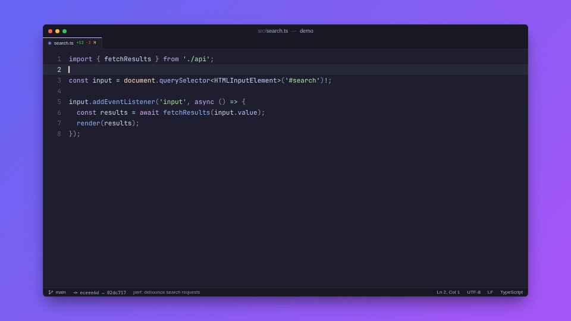
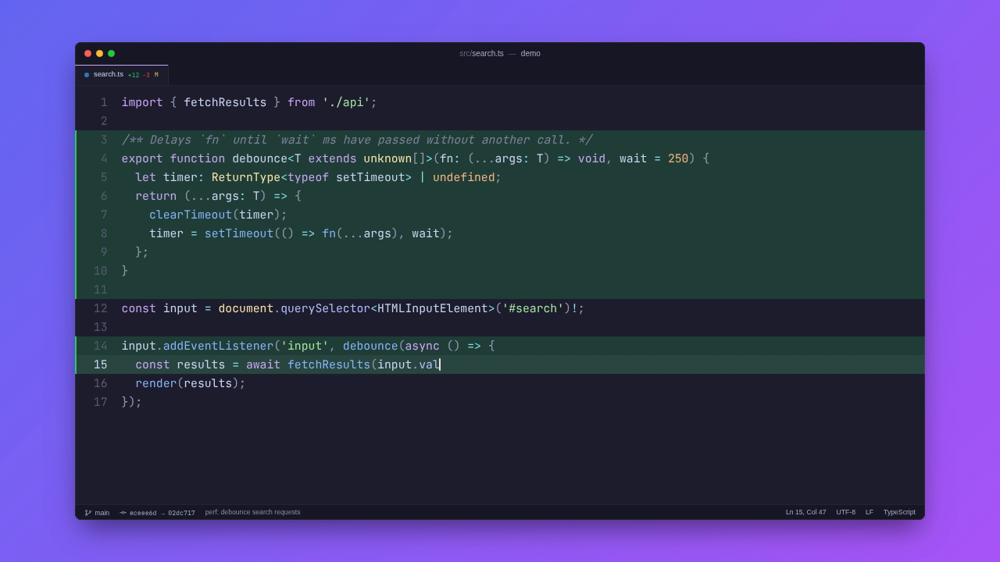

# Git-Commit Animator

**Turn any git diff into a 60fps video of the code typing itself out in a modern editor.**
Drop the MP4 or GIF into your README, docs, release notes or slides.



```bash
cd your-repo
npx github:nothikemu/animator          # → ./animation.mp4 of your latest commit
```

Free, open source (MIT), with no telemetry and no accounts. It runs entirely on your machine.

---

## Features

- **Zero configuration.** Run it inside a repository and it animates `HEAD~1 → HEAD` into `./animation.mp4`.
- **Looks good by default.** macOS-style window, a gradient canvas, the JetBrains Mono font (bundled), syntax highlighting for 30+ languages, green highlights for added lines, and deleted lines that turn red and then collapse.
- **Typing that looks human.** Each keystroke takes 15–45 ms, with pauses at line breaks, auto-indent and smooth scrolling. The rhythm is seeded, so the same commit range always produces the same video.
- **Web-ready output.** H.264 MP4 at a locked 60fps, `yuv420p`, BT.709 color tags and `faststart`, so it plays in every browser and on GitHub. GIFs use a two-pass 256-color palette.
- **Fast.** Several headless Chrome processes render in parallel. Duplicate frames are hard-linked instead of re-rendered, and only the editor window is captured for each frame.
- **Safe.** It reads your repository without changing it, uses no shell (so there is no command injection), cleans up temporary files even on Ctrl+C, and only replaces the output file once encoding has finished.
- **Two dependencies:** [`puppeteer`](https://pptr.dev) and [`fluent-ffmpeg`](https://github.com/fluent-ffmpeg/node-fluent-ffmpeg). Everything else, including the highlighter, uses Node built-ins.



---

## Setup

You need **Node.js 22.12 or newer**, **git**, and **ffmpeg**. Headless Chrome is downloaded for you automatically.

### 1. Node.js and git

| OS | Command |
| --- | --- |
| macOS | `brew install node git` |
| Ubuntu / Debian | `curl -fsSL https://deb.nodesource.com/setup_22.x \| sudo -E bash - && sudo apt install -y nodejs git` |
| Fedora | `sudo dnf install -y nodejs git` |
| Windows | `winget install OpenJS.NodeJS.LTS Git.Git` |

Check that both are installed with `node --version` and `git --version`.

### 2. ffmpeg

<details open>
<summary><b>macOS</b></summary>

```bash
brew install ffmpeg          # Homebrew: https://brew.sh
ffmpeg -version
```
</details>

<details>
<summary><b>Ubuntu / Debian / Linux Mint / WSL</b></summary>

```bash
sudo apt update
sudo apt install -y ffmpeg
ffmpeg -version
```
</details>

<details>
<summary><b>Fedora / RHEL</b></summary>

Fedora's default `ffmpeg-free` package does not include the H.264 encoder (libx264). Enable [RPM Fusion](https://rpmfusion.org/Configuration) and swap in the full build:

```bash
sudo dnf install -y https://mirrors.rpmfusion.org/free/fedora/rpmfusion-free-release-$(rpm -E %fedora).noarch.rpm
sudo dnf swap -y ffmpeg-free ffmpeg --allowerasing
ffmpeg -encoders | grep libx264    # should print a line
```

If you only want GIFs, `ffmpeg-free` works: use `-o animation.gif`.
</details>

<details>
<summary><b>Arch / Manjaro, Alpine, openSUSE</b></summary>

```bash
sudo pacman -S ffmpeg                 # Arch / Manjaro
sudo apk add ffmpeg                   # Alpine
sudo zypper install ffmpeg-7          # openSUSE (Packman repository for H.264)
```
</details>

<details>
<summary><b>Windows</b></summary>

Pick one package manager:

```powershell
winget install --id Gyan.FFmpeg -e     # built into Windows 10/11
choco install ffmpeg                   # Chocolatey (run as Administrator)
scoop install ffmpeg                   # Scoop
```

**Open a new terminal afterwards**, because PATH changes only reach new shells. Then check:

```powershell
ffmpeg -version
```

**Manual install (no package manager):**

1. Download a "release essentials" build from <https://www.gyan.dev/ffmpeg/builds/> and unzip it to `C:\ffmpeg`.
2. Add `C:\ffmpeg\bin` to your PATH: *Start → "Edit the system environment variables" → Environment Variables… → Path → Edit → New*, or run this in PowerShell:
   ```powershell
   [Environment]::SetEnvironmentVariable("Path", $env:Path + ";C:\ffmpeg\bin", "User")
   ```
3. Open a new terminal and run `ffmpeg -version`.
</details>

**ffmpeg is installed but not on PATH?** Point the tool at it directly:

```bash
export FFMPEG_PATH=/opt/ffmpeg/bin/ffmpeg          # macOS / Linux
setx FFMPEG_PATH "C:\tools\ffmpeg\bin\ffmpeg.exe"  # Windows (then open a new terminal)
```

If ffmpeg can't be found, the CLI stops before rendering anything and prints install instructions for your OS.

### 3. Headless Chrome (automatic)

Installing the package also runs Puppeteer's install step, which downloads a matching build of `chrome-headless-shell` to `~/.cache/puppeteer`. If that step was skipped (for example by `--ignore-scripts` or an offline install), the CLI downloads Chrome on its first run. You can also install it manually:

```bash
npx puppeteer browsers install chrome-headless-shell
```

To use a Chrome or Chromium you already have, set `PUPPETEER_EXECUTABLE_PATH=/path/to/chrome`.

### 4. Install the tool

```bash
# Run without installing
npx github:nothikemu/animator

# Or install globally. This adds two commands: git-commit-animator and git-animate
npm install -g github:nothikemu/animator

# Or from a clone
git clone https://github.com/nothikemu/animator.git
cd animator && npm install && npm link
```

`git-animate` is also a git subcommand, so `git animate` works too.

---

## Usage

```bash
git-commit-animator                              # latest commit → ./animation.mp4
git-commit-animator a1b2c3d                      # one specific commit (vs. its parent)
git-commit-animator v1.0.0 v1.1.0                # everything between two refs
git-commit-animator HEAD~3..HEAD -o demo.gif     # a GIF of the last three commits
git-commit-animator main...feature               # what a branch changed since it forked
git-commit-animator HEAD~1 HEAD -- src/ lib/     # only some paths (git pathspec)
git animate --theme daylight --size 1440p        # as a git subcommand
```

Here's what the terminal shows (a real run on the demo repository):

```
$ git-commit-animator --size 720p --max-duration 14

  ◆ Git-Commit Animator v1.0.0
  Turn any commit into a typing animation for your README.

[1/3] 📂 Analyzing Git Commits...
      Repository demo /home/me/demo
      Commits    eceee6d → 02dc717  "perf: debounce search requests"
      Changes    1 file  +12 -3
      • src/search.ts  +12 -3
      ✔ Headless Chrome ready (3 parallel renderers) (395ms)
      ⚠ Typing sped up 1.5× to fit --max-duration 14s (raise it for a slower take).

[2/3] 🎬 Rendering 841 Frames...
      Output     1280×720 @ 60fps · 14s · theme nebula
      ███████████████████▉░░░░░░░░░░░░  62%  525/841 frames  94.6/s  ETA 3.3s

[3/3] 🚀 Compiling MP4 Video...
      ✔ H.264 encoded (yuv420p, BT.709, faststart) in 7.1s

  ╭────────────────────────────────────────────────────────────────╮
  │ ✔ Animation ready!                                             │
  ╰────────────────────────────────────────────────────────────────╯

    Saved to   /home/me/demo/animation.mp4
    Format     MP4 · H.264
    Video      1280×720 · 60fps · 14s · 841 frames
    Size       314 KB
    Took       16s
```

When rendering finishes, the progress bar is replaced by a summary line: `✔ 841 frames (502 rendered, 339 deduplicated) in 8.6s`.

### Choosing revisions

| You type | Base (start) | Target (end) |
| --- | --- | --- |
| *(nothing)* | parent of `HEAD` | `HEAD` |
| `<commit>` | parent of `<commit>` | `<commit>` |
| `<a> <b>` | `<a>` | `<b>` |
| `<a>..<b>` | `<a>` | `<b>` (an empty side means `HEAD`) |
| `<a>...<b>` | merge base of `a` and `b` | `<b>` |
| `--base X --target Y` | `X` | `Y` |

If the target is the repository's first commit, the animation starts from an empty editor.

### Options

| Option | Default | Description |
| --- | --- | --- |
| `-r, --repo <path>` | current folder | Repository to read (any subfolder works) |
| `-b, --base <rev>` | parent of target | Starting revision |
| `-t, --target <rev>` | `HEAD` | Final revision |
| `-o, --output <file>` | `./animation.mp4` | `.mp4` / `.m4v` / `.mov` or `.gif` |
| `-f, --format <mp4\|gif>` | from extension | Force a format |
| `-s, --size <WxH\|preset>` | `1080p` (MP4), `720p` (GIF) | `480p` `540p` `720p` `1080p` `1440p` `4k` `square` or e.g. `1600x900` |
| `--fps <n>` | `60` (MP4), `30` (GIF) | GIFs are capped at 50 because GIF frame delays are stored in hundredths of a second |
| `--theme <name>` | `nebula` | `nebula`, `midnight`, `daylight` (see `--list-themes`) |
| `--background <c1,c2>` | `#6366f1,#a855f7` | Canvas gradient (one or two CSS colors) |
| `--font-size <px>` | `22` | Code font size at 1080p (scales with `--size`) |
| `--title <text>` | repo name | Text in the window title bar |
| `--speed <n>` | `1` | Typing speed multiplier |
| `-d, --max-duration <s>` | `30` | Video length limit. Big diffs type faster to fit |
| `--max-files <n>` | `8` | Keep the n biggest changes |
| `--all-files` | off | Include lockfiles and minified/generated files |
| `--seed <n>` | from commit hashes | Change the typing rhythm |
| `--crf <0-51>` | `18` | H.264 quality (lower is better) |
| `-w, --workers <n>` | auto | Parallel headless Chrome processes |
| `--batch-size <n>` | `120` | Frames per render batch |
| `--keep-frames` | off | Keep the PNG frames and print where they are |
| `-q, --quiet` | off | Print only the output path (handy in scripts) |
| `--verbose` | off | Debug log, full ffmpeg output, stack traces |
| `--no-color` | off | Plain output (`NO_COLOR` / `FORCE_COLOR` also work) |

Exit codes: `0` success, `1` failure, `2` invalid usage or revision, `130`/`143` interrupted.

---

## Embedding the result

**MP4 on GitHub (recommended: sharpest and smallest).** Edit your README on github.com and drag `animation.mp4` into the editor. GitHub uploads it and inserts a `https://github.com/user-attachments/assets/...` link, which renders as an inline player.

**GIF anywhere Markdown renders:**

```markdown

```

**HTML video (docs sites, GitHub Pages):**

```html
<video src="animation.mp4" autoplay loop muted playsinline width="960"></video>
```

Tips: `--size 960x540 -o demo.gif` keeps GIFs under about 1 MB. Use `--max-duration 15` for a quick loop, and add `-- path/to/file` to show only the interesting file.

---

## How it works

```
 git (spawn, no shell)         Timeline (pure, seeded)          Headless Chrome pool          ffmpeg
┌──────────────────────┐   ┌───────────────────────────┐   ┌──────────────────────────┐   ┌──────────────────────┐
│ rev-parse / diff     │──▶│ rows: context/del/add     │──▶│ N browser processes      │──▶│ composite window over│
│ --raw -z, numstat,   │   │ humanized keystrokes      │   │ batched queue, absolute  │   │ static background    │
│ cat-file --batch,    │   │ scroll physics, blink     │   │ views, hard-linked dups, │   │ libx264 60fps yuv420p│
│ histogram -U0 hunks  │   │ fit to --max-duration     │   │ window-only PNG capture  │   │ or 2-pass GIF palette│
└──────────────────────┘   └───────────────────────────┘   └──────────────────────────┘   └──────────────────────┘
        [1/3] Analyze                                              [2/3] Render              [3/3] Encode
```

[docs/ARCHITECTURE.md](docs/ARCHITECTURE.md) covers the design decisions: why views are absolute, how deduplication and static/dynamic layer separation work, how PTS stays exact, color management, and the security model.

**Measured on a 4-core cloud VM** (1080p60, 30s, 1,801 frames): rendering takes 23s (3 workers, 1,103 unique frames) and encoding takes 25s. A 14-second 720p clip takes about 16s from start to finish.

---

## Programmatic API

```js
import { generateAnimation } from 'git-commit-animator';

const result = await generateAnimation({
  repo: '/path/to/repo',
  base: 'v1.0.0',
  target: 'v1.1.0',
  output: 'release.mp4',
  size: '1440p',
  theme: 'midnight',
  maxDuration: 20,
});
console.log(result.output, result.frames, result.bytes);
```

Lower-level building blocks are exported too: `collectDiff`, `createFileModel`, `createTimeline`, `FrameRenderer`, `encodeVideo`, `tokenize` and others.

---

## Troubleshooting

<details>
<summary><b>"ffmpeg is required … but it was not found"</b></summary>

Install it with the steps above, then **open a new terminal**. If it's installed in an unusual place, set `FFMPEG_PATH`. When `FFMPEG_PATH` is set, it is the only binary the tool uses, so a wrong value is reported instead of quietly ignored.
</details>

<details>
<summary><b>"has no H.264 encoder (libx264)"</b></summary>

Your ffmpeg build doesn't include x264 (this is common with Fedora's `ffmpeg-free`). Install a full build (see Fedora above), or render a GIF with `-o animation.gif`.
</details>

<details>
<summary><b>Chrome fails to start on Linux / WSL / Docker ("error while loading shared libraries")</b></summary>

Install Chrome's runtime libraries:

```bash
sudo apt-get install -y libnss3 libatk1.0-0 libatk-bridge2.0-0 libcups2 libdrm2 libxkbcommon0 \
  libxcomposite1 libxdamage1 libxfixes3 libxrandr2 libgbm1 libpango-1.0-0 libcairo2 libasound2
```

The Chrome sandbox can't run as root or in most containers. The tool detects both cases and turns the sandbox off for you. To force that elsewhere, set `GIT_COMMIT_ANIMATOR_NO_SANDBOX=1`. This is safe here because the page only shows the tool's own escaped HTML, and a strict Content-Security-Policy blocks all network access.
</details>

<details>
<summary><b>"this is a shallow clone"</b></summary>

CI checkouts often contain just one commit, so its parent isn't available. Run `git fetch --deepen=1`, or set `fetch-depth: 2` in `actions/checkout`.
</details>

<details>
<summary><b>The video is too fast or too slow</b></summary>

Big diffs type faster so they fit within `--max-duration` (30s by default). Raise it (`-d 60`), narrow the diff with a pathspec (`-- src/feature.ts`), or use `--speed 0.7` for slower typing.
</details>

<details>
<summary><b>Out of disk space / slow machine</b></summary>

Frames are written to your OS temp folder and deleted afterwards. Point `TMPDIR` (or `TEMP` on Windows) at a bigger drive if you need to, use a smaller `--size`, or reduce `--workers` on machines with little RAM (each worker is one headless Chrome).
</details>

---

## Project structure

```
git-commit-animator/
├── bin/
│   └── git-commit-animator.js     # executable entry (also exposed as `git-animate`)
├── src/
│   ├── cli.js                     # argument parsing, terminal UI, pipeline orchestration
│   ├── index.js                   # programmatic API exports
│   ├── engines/
│   │   ├── renderer.js            # HTML template, headless Chrome pool, batched capture loop
│   │   ├── encoder.js             # ffmpeg discovery, MP4/GIF encoding, atomic output
│   │   ├── timeline.js            # diff → rows → humanized keystroke schedule → frame views
│   │   ├── highlighter.js         # zero-dependency syntax highlighter (30+ languages)
│   │   └── themes.js              # editor color themes
│   └── utils/
│       ├── git.js                 # git process wrapper, repo/commit resolution, diff parsing
│       ├── terminal.js            # colors, progress bars, spinners, result boxes
│       ├── cleanup.js             # temp dirs, signal handling, guaranteed teardown
│       └── errors.js              # AnimatorError with user-facing hints
├── assets/fonts/                  # JetBrains Mono (OFL 1.1), embedded into the page
├── docs/                          # ARCHITECTURE.md, demo.gif, preview.png
├── test/                          # node:test suites (unit + end-to-end)
├── .github/workflows/ci.yml       # Linux / macOS / Windows CI
├── package.json
└── LICENSE
```

## Development

```bash
npm install
npm test            # unit + end-to-end (the e2e tests need ffmpeg and skip without it)
npm run test:unit   # fast unit tests only
npm start -- --help
```

Contributions are welcome. Keep the dependency count at two.

## License

MIT for the code. The bundled JetBrains Mono font is under the SIL Open Font License 1.1 (`assets/fonts/OFL.txt`).
